# iSpace

自托管的内部 AI 应用平台。让不写代码的人也能把一个页面发布到公司域名下、
分享给同事、并在手机上打开——用一句话完成，而不是提一张运维工单。

```
你：把这个周报页面发到我的空间，叫「周报」

Claude 调用 MCP → 密钥扫描 → 原子切换软链 → 发布完成
        https://ispace.example.com/zhangming/zhoubao/
```

发布链路带密钥扫描与 XSS 检查，每个人有独立的数据 schema 与配额，
所有动作进审计日志。同一套东西有网页控制台、命令行和手机壳三个入口。

> **状态**：核心闭环已跑通并在生产使用。这是一个真实内部平台的开源版本，
> 不是演示项目。界面与文档为中文。

---

## 界面

> 下面所有截图都取自本机演示实例，数据全部是编的（人名、页面名、用量、
> 审计记录），域名是 `ispace.localhost`。没有任何真实内部信息。

**我的页面**——登录后的落地页。分组卡片墙，顶部是同事分享待接受的卡片。

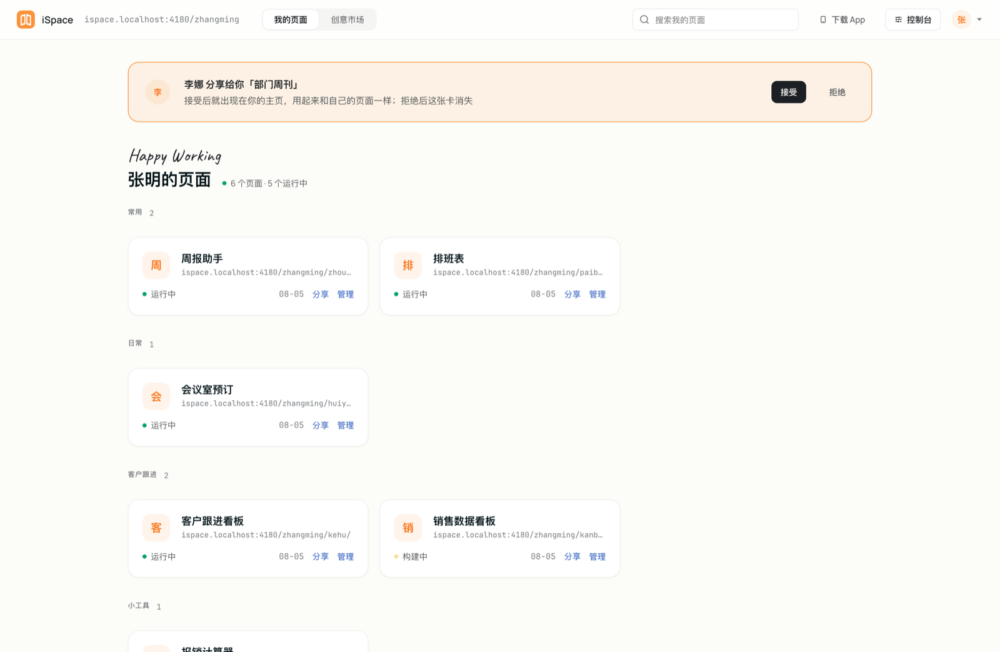

**空间总览**——你的地址、配额、最近发布，一屏看完。左下角那段是一句话发布的示例。

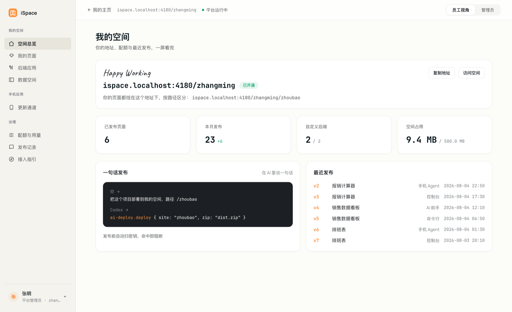

**接入指引**——把中间那段话复制给 AI，它自己就把 MCP 接好了。
不用找配置文件，也不用开终端。

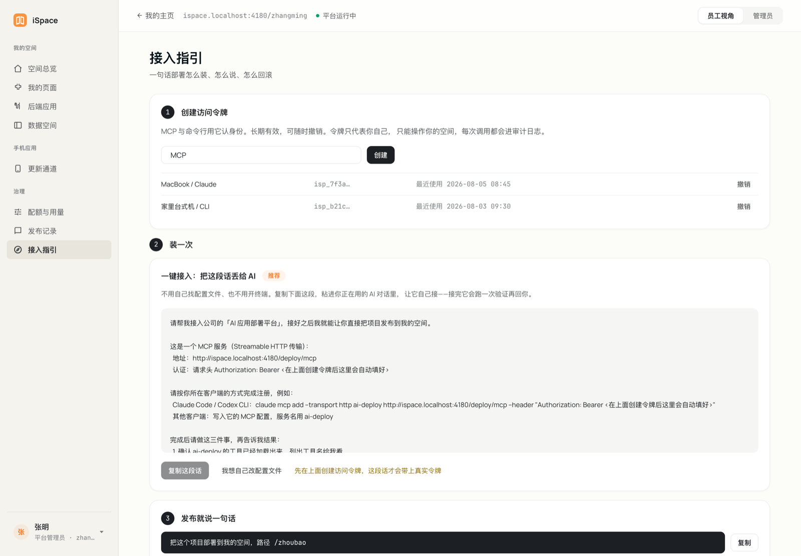

**发布记录**——每次发布留痕：谁、何时、从哪个入口、结果。
「被阻断」是密钥扫描命中后拦下来的那些。

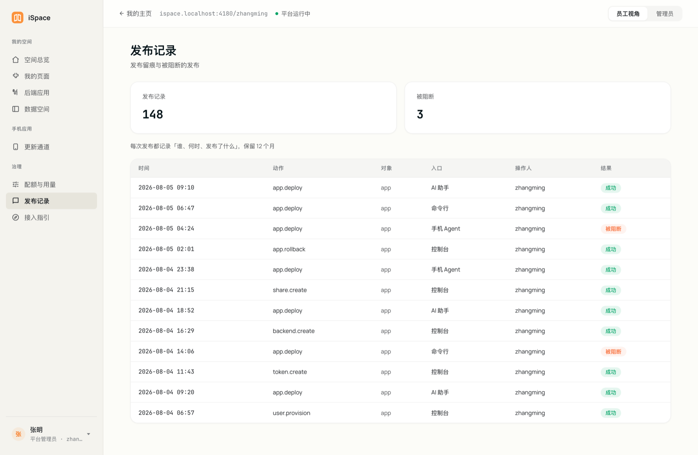

**平台总览（管理员）**——容量、发布量、单机负载。

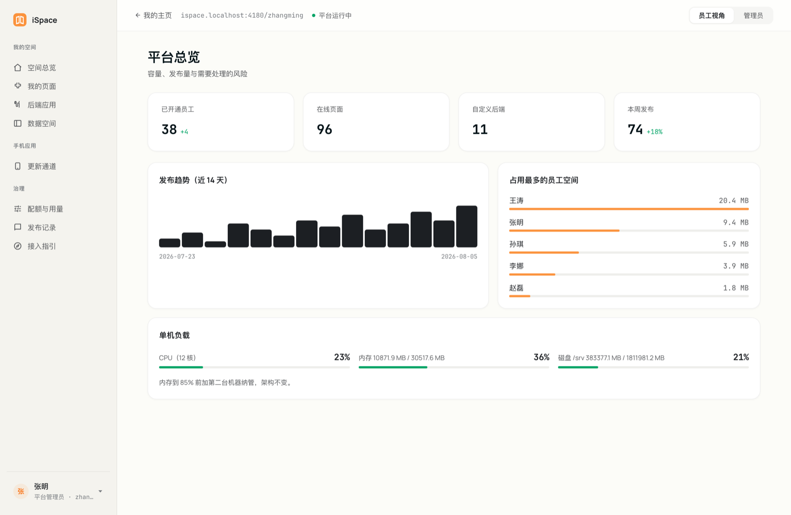

<details>
<summary>更多截图（我的页面管理、配额、后端应用、更新通道、员工与开通、平台巡检、登录页）</summary>

**我的页面**（控制台）——版本、来源、可见性、分享对象，以及回滚入口。

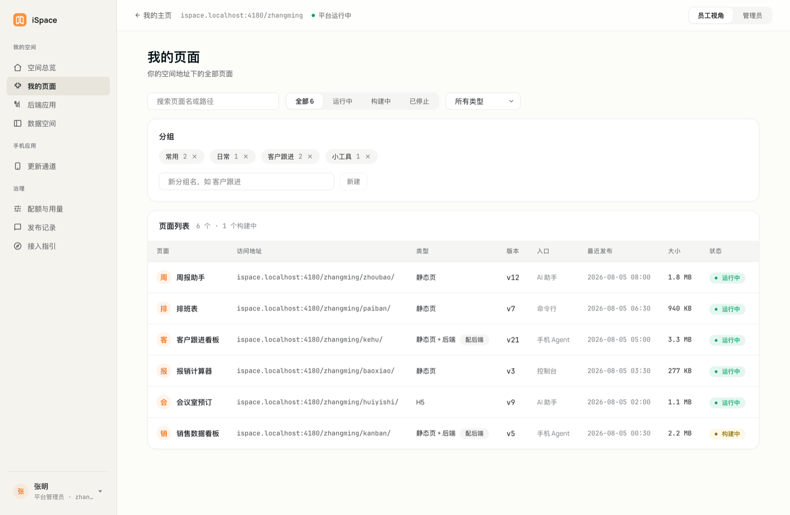

**配额与用量**——静态空间、后端应用、数据行数三档，超了可以在这里申请。

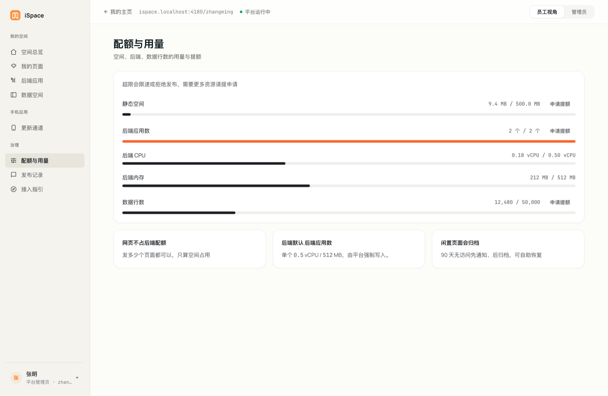

**后端应用**——需要自定义后端时在这里开，CPU / 内存限额由平台强制写入。

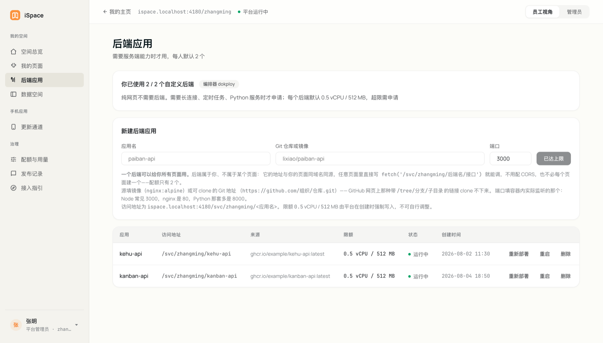

**更新通道**——手机端页面包的版本、灰度比例与到端设备数。

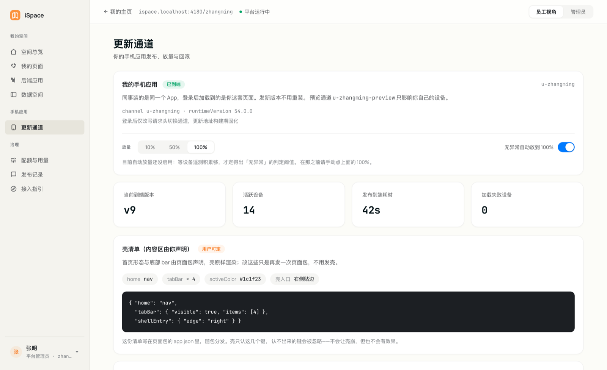

**员工与开通（管理员）**——开通、改角色、重置密码、离职回收。

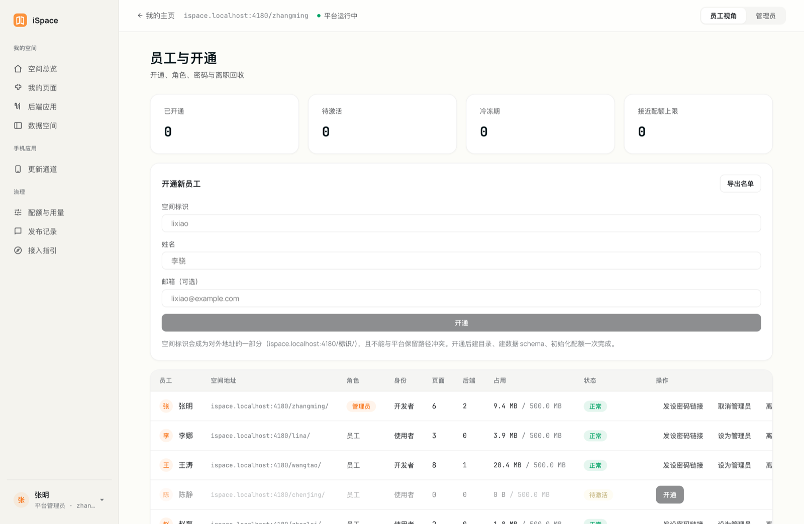

**平台巡检（管理员）**——把「重建之后还要做什么」写下来，不依赖某个人记得。

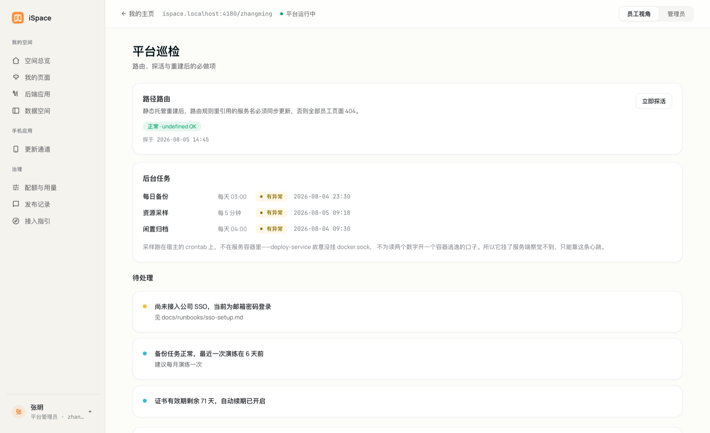

**登录页**——默认邮箱 + 密码，接了 OIDC 会多一个 SSO 入口。

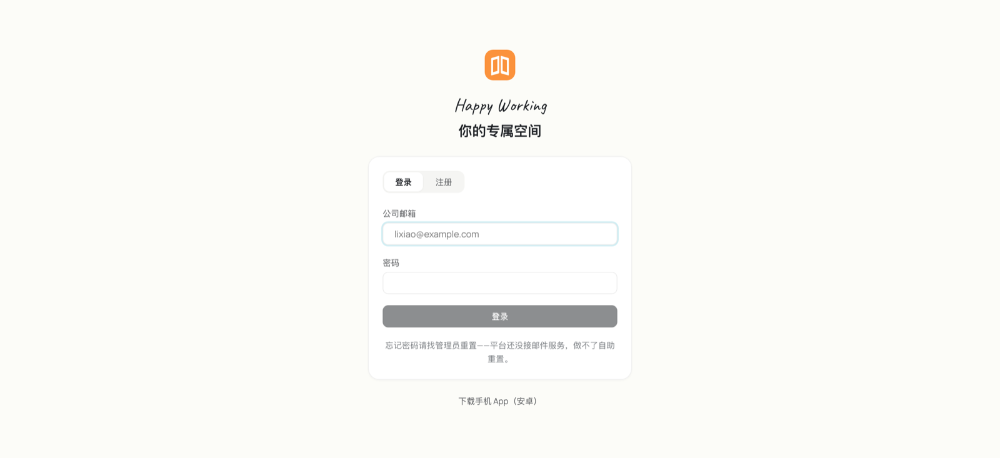

</details>

---

## 背景：为什么会有这个东西

### 卡住人的从来不是写代码

公司里会用 AI 写点小工具的人越来越多。运营写个排班表，销售写个客户跟进看板，
财务写个报销计算器——AI 生成这些页面只要几分钟。

然后就卡住了。卡住的地方从来不是"写不出来"，而是写完之后：

- **放哪。** 本地开个 `python -m http.server` 只有自己能看。丢到聊天群里
  发个 zip，别人下载解压双击，路径一错就是白屏。
- **怎么给别人看。** 要一个别人打开就能用的地址。找运维要，运维要问清楚
  这是什么、谁负责、出了事找谁——一张工单三天。
- **数据存哪。** 稍微像样一点的工具就要存数据。让每个人自己去开一个数据库、
  自己管连接串和密码，既不现实也不安全。
- **万一发错了。** AI 生成的代码里带着一个硬编码的 API key，发出去就是
  公司级的事故。而写的人多半意识不到。

于是大多数人做到一半就放弃了，或者做出来只有自己在用。**AI 把"生产内容"的
成本降到了近乎零，但"把内容交付出去"的成本一点没降。** iSpace 补的是后半截。

### 平台要替人兜住的四件事

| 需求 | 平台给的 |
|---|---|
| 我的页面放哪 | `/{你}/{应用}/`，公司域名下的固定地址，发布秒级生效、可回滚 |
| 怎么发 | Claude 里一句话（MCP）、`ai-deploy` 命令行、或控制台上传 |
| 要存数据 | 每人一个 Postgres schema + RLS，连接信息 MCP 直接给模型 |
| 要个后端 | 控制台点一下开一个容器，CPU / 内存限额强制写入 |
| 给同事用 | 分享给个人，或上架内部「创意市场」 |
| 手机上看 | Expo 壳，页面可作为 tab 嵌入，支持自托管热更新 |
| 要调外部接口 | 连接器：凭据平台加密保管并注入，页面代码里不出现密钥 |
| 别把密钥发出去 | 发布链路 gitleaks 扫描，命中即阻断并留痕 |

### 几条贯穿始终的判断

**给不写代码的人用，就不能要求他们理解部署。** 「接入指引」那一屏的最终形态
是一段可以整段复制、丢给 AI 让它自己完成接入的话——因为让人自己拼 header、
从 cookie 里抠 token，实际上没人会用。

**便利不能以牺牲隔离为代价。** 每个人一个数据 schema、一份配额、一个工作区；
用户页面的访问要过服务端鉴权（Caddy `forward_auth`），`visibility` 那三档
是真的访问控制，不是展示过滤。

**默认值要往安全的一边倒。** 自助注册的邮箱白名单默认是一个匹配不上任何人的
占位：忘了配的后果是"谁都注册不了"，而不是"谁都注册得了"。两种失败的代价
不对等。

**规模化的形态要一开始就选对。** 静态站点是**单个多租户容器**按路径映射用户
目录，不是"一人一个部署应用"——后者到几十人就撑不住。只有确需自定义后端时
才去创建独立应用。

---

## 架构

```
                   Traefik（Dokploy 内置，80/443）
                               │
     ┌─────────────────┬───────┴────────┬──────────────────┐
     │                 │                │                  │
静态托管 + portal   deploy-service   updates-service    Supabase
 (Caddy 多租户)     REST + MCP 同进程  expo-updates 协议   每用户一 schema
     │                 │                                  + RLS
/srv/sites         Dokploy REST API
/srv/releases      （建后端、绑路径、写限额）
```

几个有意为之的选择：

- **单域名 + 路径**（`/{user}/{app}/`），不用泛域名。一条 A 记录、
  HTTP-01 自动签发，不需要 DNS API 凭据。代价是用户名与平台路径共享命名空间，
  用 `RESERVED_PATHS` 强校验对冲。
- **平台 chrome 在发布期注入**（往 `index.html` 塞
  `<script src="/platform/shell.js">`），不在网关运行期改写响应体——后者要给
  Caddy 引入重写插件，且干扰流式响应与缓存。
- **发布是原子的**：产物解压到 `releases/{时间戳}/`，再切软链。回滚就是把软链
  切回去，秒级生效，旧版本仍在盘上。

设计决策与其理由的完整记录见
[docs/specs/2026-08-03-ispace-platform-design.md](docs/specs/2026-08-03-ispace-platform-design.md)。

---

## 仓库结构

pnpm workspaces + Turborepo，TypeScript 全栈。

```
apps/
  portal/            统一入口：登录引导、/{user}/ 聚合页、创意市场
  console/           控制台：员工 8 屏 + 管理员 7 屏
  deploy-service/    部署服务 REST + MCP server（同进程，Fastify）
  shell-js/          平台 chrome，构建为 /platform/shell.js 单文件
  updates-service/   自托管 expo-updates 更新服务器
  mobile-shell/      Expo 手机壳
packages/
  contracts/         zod schema + 类型 + 保留字表 + 错误码 —— 全仓唯一真相源
  ui/                设计系统：tokens + React 组件
  copy/              业务口径 / 技术口径 双语文案字典
  auth/              OIDC 抽象层 + 邮箱密码 + session
  orchestrator/      编排抽象：Dokploy（生产）/ Mock（本地与单测）
  storage/           releases 解压 + 软链原子切换 + 回滚
  scanner/           gitleaks + XSS 规则 + base path 校验
  db/                平台元数据库迁移 + 用户 schema provisioning
  agent/             Coding Agent 引擎抽象与工具集
  cli/               ai-deploy
infra/
  dokploy/           compose 定义与路由绑定
  caddy/             Caddyfile
  scripts/           部署脚本（幂等，编号即执行顺序）
docs/                设计规格、实现计划、部署与运维手册
```

`packages/contracts` 是骨架的核心资产：实体 schema、API 契约、MCP 工具入参、
`RESERVED_PATHS`、错误码全部在这里定义一次，其余包一律从它导入。
新增平台顶层路径必须同步 `RESERVED_PATHS` 与 `infra/caddy/Caddyfile` 的排除列表。

---

## 快速开始（本机）

需要 Node 22+ 与 pnpm 11+。

```bash
pnpm install
pnpm build
pnpm test
```

跑起开发环境（需要一个 Postgres）：

```bash
export PGHOST=localhost PGPORT=5432 PGDATABASE=postgres PGUSER=postgres
export POSTGRES_PASSWORD=...
export SESSION_SECRET=$(openssl rand -hex 32)
export ISPACE_DEV_LOGIN=1     # 开发登录页，生产绝对不要设
pnpm dev
```

deploy-service 在 `:3100`（自带 `/deploy/api` 前缀，本机无需网关），
updates-service 在 `:3200`，portal 与 console 由 Vite 起。
没配 `DOKPLOY_URL` 时编排器自动回落 `MockOrchestrator`，本机不需要 Docker。

---

## 部署到自己的服务器

脚本编号即执行顺序，全部幂等——中途失败修好后重跑同一条即可。
完整版含验收步骤与上线前 checklist：**[docs/runbooks/deployment.md](docs/runbooks/deployment.md)**。

### 0. 前置

一台干净的 Linux（Ubuntu 22.04+ 或同等），Docker 24+，4 vCPU / 8 GB / 100 GB 起。
**80、443、3000 必须空闲**——Traefik 要接管 80/443，Dokploy UI 用 3000。
机器上最好不跑别的容器编排：Dokploy 会 `swarm init`，与既有编排相互干扰。

一条 A 记录指向该机器。公网部署到这里就够了，Let's Encrypt 走 HTTP-01，
不需要 DNS API 凭据。

SSH 走密钥——自动化脚本必然高频连接，而多数 sshd 在连续密码认证后会开始拒绝：

```bash
ssh-keygen -t ed25519 -f ~/.ssh/ispace_deploy -N '' -C ispace-deploy
ssh-copy-id -i ~/.ssh/ispace_deploy.pub deploy@ispace.example.com
```

配置：

```bash
cp .env.example .env      # 按注释填写，然后 set -a; . ./.env; set +a
```

必填五项：`ISPACE_BASE_URL`、`ISPACE_PUBLIC_BASE`、`ISPACE_DOMAIN`、
`TARGET_HOST`、`ISPACE_ADMIN_EMAIL`。

### 1. 装 Dokploy

```bash
export REMOTE_SUDO_PW='...'          # 目标机 sudo 口令，不落盘
./infra/scripts/02-install-dokploy.sh
```

装完打开 `http://<服务器地址>:3000` 创建管理员账号并生成 API Token，
连同随机会话密钥写到目标机（600，不进仓库）：

```bash
./infra/scripts/remote.sh 'umask 077; mkdir -p ~/.ispace; cat > ~/.ispace/env' <<'EOF'
DOKPLOY_URL=http://127.0.0.1:3000
DOKPLOY_TOKEN=刚才生成的 token
EOF
./infra/scripts/remote.sh "umask 077; echo SESSION_SECRET=$(openssl rand -hex 32) >> ~/.ispace/env"
```

### 2. 建目录

```bash
./infra/scripts/03-provision-dirs.sh
```

建 `/srv/sites` 与 `/srv/releases`，属主设为部署用户——必须与 compose 里
`deploy-service` 的 `user:`（默认 `1000:1000`）一致，否则服务写不进去。

### 3. 装 Supabase

拉官方 compose、生成 `.env`（密钥在目标机就地生成，不经过本仓库），
再叠上本仓库的覆盖层启动。覆盖层做三件事：清掉全部宿主端口映射、把 Kong 挂到
Traefik 上并剥掉 `/supabase` 前缀、保留 Kong 的 `api-gw` 别名。
逐条命令见[部署手册第 3 节](docs/runbooks/deployment.md)。

```bash
./infra/scripts/04-supabase-env.sh
```

### 4. 部署平台服务

```bash
./infra/scripts/06-deploy-service.sh    # deploy-service（REST + MCP），跑迁移
./infra/scripts/07-deploy-caddy.sh      # 静态托管 Caddy + portal 容器
./infra/scripts/11-deploy-web.sh        # console / portal / shell.js 产物
./infra/scripts/08-deploy-updates.sh    # updates-service（要手机端才需要）
```

源码经 rsync 送到目标机后在那边构建镜像——比在本机构建再传镜像快得多。
`07` 先校验 Caddyfile 再落地，校验不过绝不部署：一个语法错误会让 Caddy 起不来，
而它是所有用户页面的出口。

### 5. 验收

```bash
curl -sI "$ISPACE_BASE_URL/"                     # portal
curl -s  "$ISPACE_BASE_URL/deploy/api/health"    # deploy-service
curl -sI "$ISPACE_BASE_URL/console"              # 控制台
```

然后端到端走一遍：注册 → CLI 发一份产物 → `/{user}/{app}/` 能打开 →
控制台看到发布记录 → 回滚 → 发一份含硬编码密钥的产物确认被阻断。

### 6. 上线前必须确认

- [ ] `ISPACE_EMAIL_DOMAINS` 已设为你自己的域名。留空 = 对全互联网开放注册
- [ ] `ISPACE_DEV_LOGIN` **没有**设置。它是可选任意身份的开发登录页，安全性等于零
- [ ] 证书已签发；Postgres 没有宿主端口映射；Dokploy 的 3000 不对公网开放
- [ ] `~/.ispace/*.env` 权限是 600
- [ ] 备份跑得通并演练过恢复（`09-backup.sh` / `10-restore-drill.sh`）

### 日常运维

| 场景 | 命令 |
|---|---|
| 开通一个用户的数据 schema | `05-provision-user-schema.sh <username>` |
| 只改了前端 | `11-deploy-web.sh` |
| 改了后端代码 | `06-deploy-service.sh` |
| 备份 / 恢复演练 | `09-backup.sh` / `10-restore-drill.sh` |
| 补一条设密码链接 | `13-issue-reset-link.sh <email>` |
| 改了更新服务 | `08-deploy-updates.sh` |
| 发安卓安装包 | `14-publish-apk.sh`（先 gradle 出包，见「手机端」） |

拓扑、目录、端口与踩过的坑见 [server-state.md](docs/runbooks/server-state.md)。

---

## 配置

全部环境变量及其含义见 **[.env.example](.env.example)**，按用途分成三组：
部署机（跑脚本时读）、服务端（服务运行时读）、手机壳（构建期读，会编译进二进制）。

密钥不走这个文件——它们放在目标机的 `~/.ispace/*.env`（600），由部署脚本注入
compose。理由很简单：`.env` 在开发机上，而密钥不该离开服务器。

HTTP 与 HTTPS 的差别不只是协议：明文 HTTP 会静默关掉一批浏览器能力
（剪贴板首当其冲），安卓与 iOS 还需要额外放行明文流量。
壳会按 `EXPO_PUBLIC_ISPACE_BASE_URL` 的协议自动决定，详见
[apps/mobile-shell/CLEARTEXT.md](apps/mobile-shell/CLEARTEXT.md)。

---

## 接入方式

**MCP**（21 个工具）——`/deploy/mcp`，复用调用者身份，只能操作本人空间，
每次调用进审计日志：

| 类别 | 工具 |
|---|---|
| 看现状 | `list-apps` `list-backends` `app-status` |
| 前端 | `deploy` `rollback` `releases` `delete-app` |
| 后端 | `create-backend` `redeploy-backend` `delete-backend` |
| 数据 | `data-connection` `list-tables` |
| 外部 API | `list-connectors` `create-connector` |
| 分享 | `set-visibility` `share-with` |
| 手机端 | `publish-app` `mobile-channel` `mobile-rollback` `set-rollout` |
| 其他 | `quota` `provision` |

**CLI**：

```bash
ai-deploy up ./dist /zhoubao      # 发布产物
ai-deploy releases /zhoubao       # 历史版本
ai-deploy rollback /zhoubao v11   # 回滚
ai-deploy backend create          # 申请后端
ai-deploy quota                   # 用量与配额
```

**REST**：`/deploy/api/*`，契约由 `packages/contracts` 生成 OpenAPI。

---

## 连接器：页面怎么调外部 API

平台会拦下前端代码里的 `api_key`——这拦得对，AI 生成的代码里带着公司的 key
发出去就是事故。但只拦不给路，结果是**凡是需要凭据的接口整类做不了**。
连接器补的就是这一半。

```
页面                     平台                        上游
fetch('/deploy/api/  →  查连接器、注入凭据      →   https://restapi.amap.com
  connect/amap/          校验目标在白名单内            /v3/weather/...
  v3/weather/...')       记一次审计
```

页面里没有密钥，也不存在跨域——对页面来说这是同源请求。

**两级归属**。个人连接器谁登记谁用；管理员可以发布**全员共享**的，普通用户
能调用但看不到凭据本身——公司统一采购的地图 key、内部 ERP 属于这一类。
注意个人连接器只在**作者自己**打开页面时有效，要分享给同事的页面得用共享的。

**内置目录**。`packages/contracts/src/connectors.ts` 里有一份现成清单，
覆盖天气、汇率、中国节假日、地图、npm、GitHub。每一条都在部署环境里
实测过连得通——国内网络下大量境外 API 不可达，抄一份网上的"公开 API 大全"
进来，用户点开发现一半是死的，比没有目录更糟。换环境后应重新验证。

**怎么用**：控制台「连接器」屏点一下登记，或者直接让 AI 做：

```
你：做个页面显示北京今天的天气
AI 调 list-connectors → 看到目录里有 open-meteo（免密钥）
   调 create-connector → 登记
   写页面 → fetch('/deploy/api/connect/open-meteo/forecast?...')
```

**安全边界**（`services/outbound-guard.ts`）。出站代理带着平台的身份，
不加限制就是一台内网扫描器，所以有四道防线：只允许 http/https；解析主机名并
拒绝一切落在私有段/回环/链路本地（含云厂商元数据地址 169.254.169.254）的目标；
每次请求前重新校验一遍（防 DNS 重绑定）；不跟随重定向（否则公网主机 302 到
127.0.0.1 就绕过了前三道）。要接内网系统得由管理员显式打开
`ISPACE_CONNECTOR_ALLOW_PRIVATE`，默认关闭。

凭据用 AES-256-GCM 加密入库，**任何接口都不会把它读回来**，包括登记者自己。
能读回来的保管等于没保管。

---

## 手机端

一个 Expo 壳，装一次，之后所有页面都热更新到端上。

### 壳分两层

```
原生壳（APK / IPA）      原生模块、expo-updates、系统权限。换它要重装
     ↑ 装一次
JS 壳运行时（apps/shell-js + mobile-shell/src/shell）
     ↑ 构建期强制合成进每一个页面包
用户页面
```

expo-updates 是**整包替换**：加载页面包时换掉的是整个 JS 层。所以底部导航、
设置、更新卡片这些平台必须替所有人兜住的东西，不能指望用户包自带——由
`tools/compose-bundle.mjs` 在 `expo export` 之前注入，用户源码里根本不存在它，
删不掉也改不了。

同一条流水线还负责：拒绝新增原生依赖（会让 runtimeVersion 漂移，更新装不上）、
校验页面包的 `app.json`、把平台地址写进产物。

### 页面有两种

- **页面包（RN）**：跑在壳里，原生渲染。经 `publish-app` 发到个人通道
- **网页（H5）**：PC 上做的页面直接在壳内 WebView 打开。壳注入的网页 chrome
  会自检并隐藏自己，顶部安全区由壳补，看起来接近原生

底栏固定四格——首页 / 我的作品 / 创意集市 / 我。首页由用户自己指定默认页面。
这四格是壳的骨架不是内容，不做成可配置：能配置的东西迟早会被配置成没人认得的样子。

### 两条独立的更新路径

| | 页面包 | 壳 |
|---|---|---|
| 大小 | 几 MB | 近百 MB |
| 通道 | 自托管 expo-updates（`updates-service`） | `/dist/version.json` + APK |
| 提示 | 底栏通栏横幅，点一下就地重载 | 「我」那一格挂个点，不打扰 |
| 安装 | 无感 | App 内下载 + 唤起系统安装器（最后一下确认绕不过） |
| 回滚 | 通道指针切回去，秒级 | 重装 |

灰度按设备 ID 分桶；未放量的设备收到 204 而不是旧 manifest——返回旧的会让壳
以为"有更新"而反复下载同一个包。

### 发一版

```bash
# 1. 合成：注入 JS 壳运行时，校验依赖与 app.json
node tools/compose-bundle.mjs --user <用户名> --src <页面工程> --out <合成目录>

# 2. 导出
cd <合成目录> && EXPO_PUBLIC_ISPACE_BASE_URL=$ISPACE_BASE_URL \
  npx expo export --platform android --clear

# 3. 发布（或让 AI 调 MCP 的 publish-app）
curl -X POST "$ISPACE_BASE_URL/deploy/api/mobile/publish" \
  -H "authorization: Bearer $ISPACE_API_TOKEN" \
  -F runtimeVersion=54.0.0 -F rolloutPercent=100 -F file=@dist.zip
```

改了环境变量一定要带 `--clear`：Metro 会缓存已内联的字面量，不清缓存就发出
一个指着旧地址的包。

### 出壳与分发

```bash
export ISPACE_APP_ID=com.yourcompany.ispace        # 反向域名，发出去过就别再改
export EXPO_PUBLIC_ISPACE_BASE_URL=$ISPACE_BASE_URL

cd apps/mobile-shell
npx expo prebuild --platform android --clean       # 改过 app.config.js 就要重来一遍
cd android && ./gradlew assembleRelease && cd ../../..

./infra/scripts/14-publish-apk.sh                  # 上架到 /dist，PC 端出二维码
```

`android/` 与 `ios/` 是 prebuild 生成的，手改会被下一次 prebuild 抹掉——
要改原生配置就写 config plugin（见 `apps/mobile-shell/plugins/`）。
下载路径 `/dist/*` 免登录，这是刻意的：同事装 App 那一刻手上还没有会话。

`ISPACE_APP_ID` 同时是**更新与覆盖安装的身份**：改了它，系统就认为这是另一个
App，既有安装收不到更新，只能重装。仓库里的默认值是 `com.example.ispace`。

⚠️ `ISPACE_PUBLIC_BASE`（服务端）与 `EXPO_PUBLIC_ISPACE_BASE_URL`（壳构建期）
**必须同 scheme**。不一致时更新会卡在「正在下载」且没有任何报错，原因和排查
路径见 [CLEARTEXT.md](apps/mobile-shell/CLEARTEXT.md)。

iOS 出包见 [docs/runbooks/ios-build.md](docs/runbooks/ios-build.md)（需要
Apple Developer 账号）。

---

## 登录

默认**邮箱 + 密码**，开箱可用。公司 SSO（OIDC）是可选的第二条路，
配齐 `OIDC_ISSUER` / `OIDC_CLIENT_ID` / `OIDC_CLIENT_SECRET` 即启用，
接法见 [docs/runbooks/sso-setup.md](docs/runbooks/sso-setup.md)。

平台身份与应用终端用户是两层，不要混：员工登录控制台走 SSO 或邮箱密码；
每个用户应用自己的登录走 Supabase Auth，数据落在该用户的 schema 内。

---

## 文档

| 文档 | 内容 |
|---|---|
| [平台设计规格](docs/specs/2026-08-03-ispace-platform-design.md) | 全部决策及其理由、数据模型、路由、验收标准 |
| [应用层实现计划](docs/plans/2026-08-03-02-application-build.md) | 分阶段构建顺序与接口边界 |
| [部署手册](docs/runbooks/deployment.md) | 从空机器到跑起来 |
| [部署拓扑与运维基线](docs/runbooks/server-state.md) | 请求链路、目录、端口、踩过的坑 |
| [SSO 接入](docs/runbooks/sso-setup.md) | OIDC 配置与账号衔接 |
| [iOS 构建](docs/runbooks/ios-build.md) | 手机壳的 iOS 出包 |
| [页面包配置](docs/guides/page-bundle-config.md) | `app.json` 声明格式 |
| [连接器](docs/guides/connectors.md) | 外部 API 接入、目录维护与安全边界 |
| [明文 HTTP 的代价](apps/mobile-shell/CLEARTEXT.md) | 安全上下文与原生开关 |
| [Supabase 子路径部署实测](infra/dokploy/supabase.notes.md) | Kong stripPrefix 与 schema 热加载 |
| [环境变量清单](.env.example) | 全部可配项，按部署机 / 服务端 / 手机壳分组 |

---

## 技术栈

TypeScript 5 · Node 22 · Fastify · zod · Postgres（Supabase）· React 19 ·
Vite · Expo / React Native · Caddy · Traefik · Dokploy · pnpm · Turborepo · Vitest

后端选 TypeScript 是因为 MCP SDK、Expo 同属 JS 生态，可与前端共享
`contracts` 的类型与鉴权中间件；这里跨语言的收益为零。

---

## License

[MIT](LICENSE)
